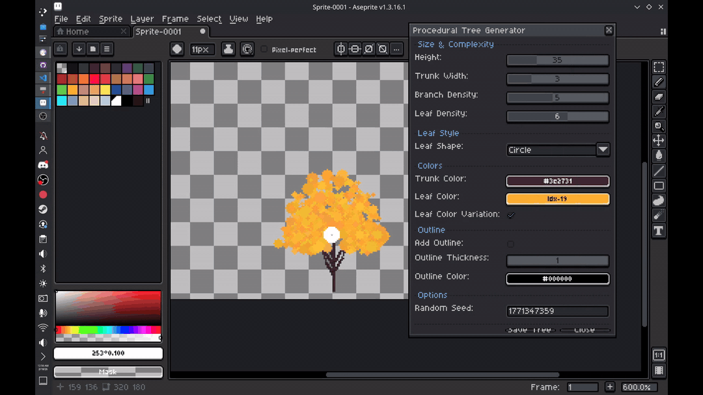
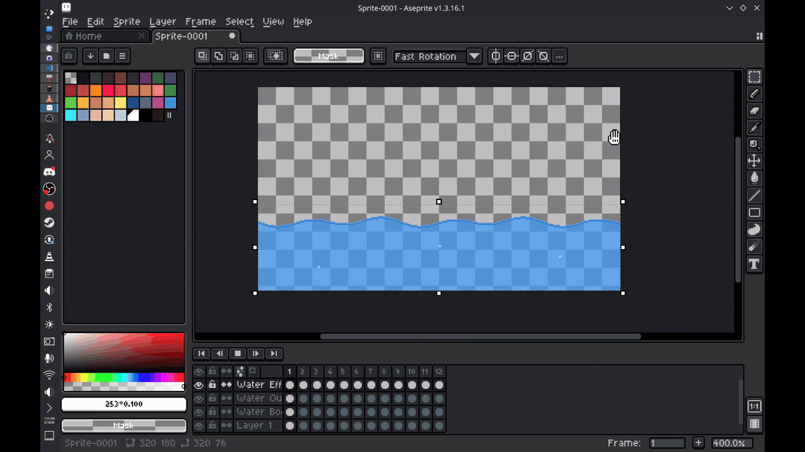

# AseTools

AseTools is a collection of custom scripts I write for **Aseprite** 

## Showcase
 Procedural Tree Generator

  

 Procedural Water

  

## Note

This repository is where I experiment with:
- Procedural generation
- Pixel art automation
- Workflow enhancements
- Weird and fun creative tools

Some scripts are practical.  
Some are experimental.  
All are made to explore what Aseprite scripting can really do.
